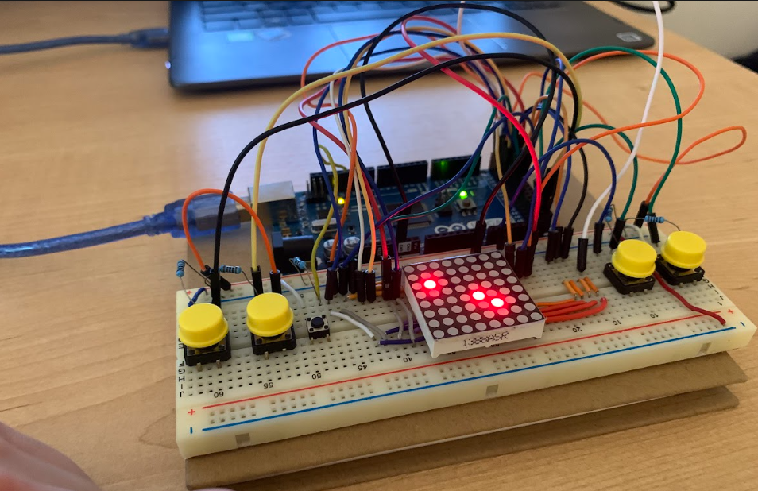

## Arduino LED Matrix Minesweeper

### Project Overview
An interactive Minesweeper-inspired game implemented on an 8x8 LED matrix using an Arduino Mega (Atmega328 Chip). Players navigate a crosshair using directional buttons to mark suspected mine locations.

### Hardware Requirements
* Arduino Mega (Atmega328 Chip)
* 8x8 LED Matrix
* Directional buttons
* Supporting electronics (wiring, resistors, etc.)

### Features
* **Interactive Gameplay**:
  - Crosshair navigation system
  - Mine position marking
  - Adjustable difficulty levels

* **Display Functions**:
  - Scrolling text messages
  - Pattern displays
  - Mine position reveals

* **Game Mechanics**:
  - Variable mine counts based on difficulty
  - Timed mine display
  - Memory-based gameplay
  - Win/lose condition tracking

### Game Rules
1. Mines are briefly displayed at game start
2. Players must remember mine positions
3. Navigate using directional buttons
4. Mark suspected mine locations
5. Win by correctly identifying all mines

### Customization
* Adjustable difficulty levels
* Customizable display timing
* Modifiable game patterns

---
© 2025 George Morales - Arduino LED Matrix Minesweeper
